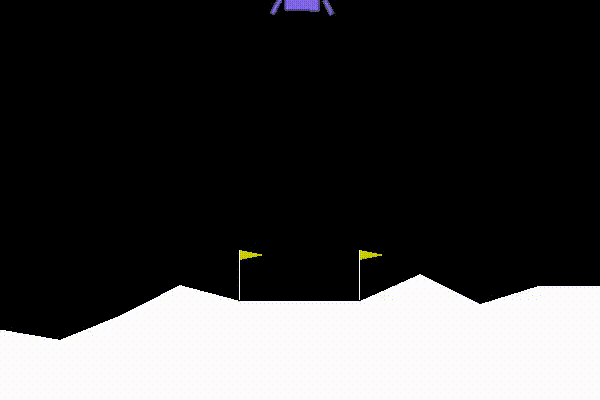

[](https://travis-ci.com/TTitcombe/docker_openai_gym)
# OpenAI gym Docker Image

This Docker image comes with openai and pytorch-cpu. This allows users to start working on reinforcement learning in a couple of easy steps.

This image is particularly ideal for Windows users, for whom openai gym is not easily installed.

Current features:
* cpu enabled pytorch
* classic control gym environments
* box2d environments
* Recording of environments

To be developed:
* Automated environment recording (no manual command entry)
* environment rendering
* Atari environments
* cpu enabled tensorflow

## How to use
1. Either
    - Clone the repo and build the image: `docker build --tag=image_name .`
    - pull the image: `docker pull ttitcombe/rl_pytorch:latest`
2. Launch the container: `docker run -it --name=container_name image_name python`. This should enter the python interpreter.
3. Before entering the python interpreter, a script to attach the graphical display should have been run. 
4. If you want to re-enter the container and record, you can run `/usr/local/bin/startup_script.py` as the `CMD`, 
e.g. `docker exec -it container_name /usr/local/bin/startup_script.py`. This should enter a bash script.  
Alternatively, you can open a bash script and run it from there. 
5. If you want to re-enter the container, record, AND run something, try
`/usr/local/bin/startup_script.py "python /path/to/my/file.py"` as your `CMD`.
6. If you don't care about recording, use `/bin/bash` to enter bash or `python` to enter the python interpreter.

To test that the container works, try recording an environment:
```python
import gym
import torch

env_to_wrap = gym.make("LunarLander-v1")
env = gym.wrappers.Monitor(env_to_wrap, "someDir")
frame = env.reset()
is_done = False
while not is_done:
  action = env.action_space.sample()
  _, _, is_done, _ = env.step(action)
env.close()
env_to_wrap.close()
``` 
If this doesn't throw an error, then congratulations, you can record OpenAI gym!

You can extract the recording once you are outside of the container with the command `docker cp container_name:/path/to/my/file local/path/to/file`.

# docker_rl
# docker_rl
